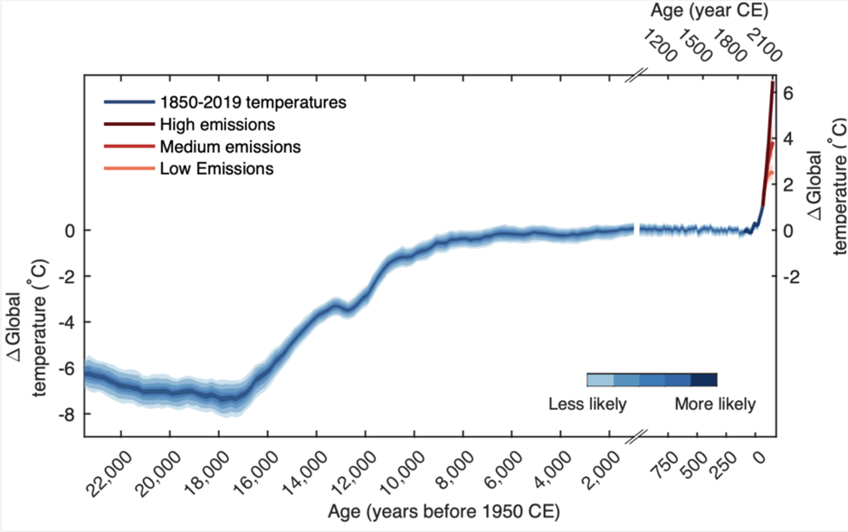

## Climate Crisis

### The 'Hockey Stick'

According to a 2021 report, the past thousand years or so have displayed a pattern of a 'hockey stick':

- Incredible increase in global temperature in recent 70 years
- A few years following the 2IR, about the time the 3IR began
- Indicative of many of the effects that industrialisation brought upon the world

## Solutions

### Carbon Capture Systems (CCS)
- Idea is to reach "net zero" emissions
- Used by many Big Tech companies

#### Natural Solutions (Replantation)
- Using trees are GHG Sinks

#### Mechanized Solutions
- Sped up the process
- Continue to deplete Natural Resources

## Problems

### CCS
- Highly short-term solutions --> more leeway for further industrialisation
- Cyclical system of GHG gas emission + absorption is not sustainable

### Greenwashing
- Many Big Tech companies + Governments do this
- "_We pledge to reach the state of **Net Zero Emissions/Carbon Neutral/Carbon Negative** by **Some Faraway Stipulated Deadline**_"
- Short term interims have stopped (e.g. with the 2015 Paris Agreeement)
- Zero accountability

## Local Context

### Paris Agreement + "Interims"
- 2015: Singapore pledged to reduce emissions intensity by **36%** by 2030.
- 2021 Glasgow Conference: Re-evaluated this claim, set it up in Budget 2022

### Pre-Covid Initiatives
- **30-by-30 Target** (from 2019): meet 30% of nutritional needs through locally produced food by 2030

### Budget 2022
- **Progressively raise carbon tax until about mid-century (2050)**
- Goal: reach net-zero emissions

### Singapore Green Plan 2030
- 20% of schools to be “Carbon Neutral”
- Quintuple Solar Energy Deployment