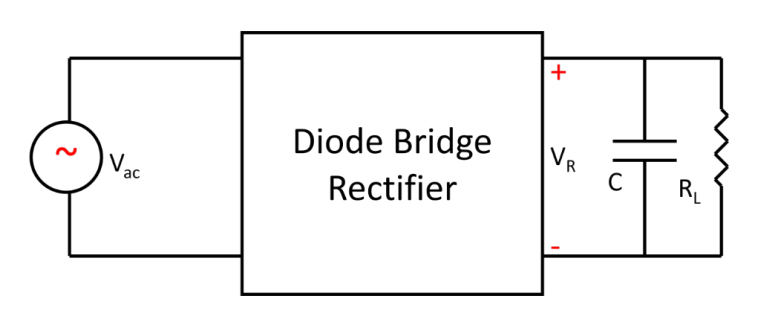

# Tutorial 3

## Question 1
> **The primary voltage of a transformer is 65 V RMS, and the number of turns in the primary and secondary windings are 60 and 90, respectively. Calculate the RMS voltage across the secondary winding of the transformer.**

$$V_\text{rms, 2} = \frac{N_2}{N_1} V_\text{rms, 1} = \frac{90}{60} \times 65 = \textbf{97.5 V RMS}$$

**Answer:** 97.5 V RMS

## Question 2
> **Calculate the number of turns required in the primary winding of a transformer, if the primary voltage is 25 V RMS, and the secondary voltage is 90 V RMS. There are 36 turns in the secondary winding.**

$$N_1 = N_2 \frac{V_\text{rms, 1}}{V_\text{rms, 2}} = 36 \times \frac{25}{90} = \textbf{10 turns}$$

**Answer:** 10

## Question 3
> **The secondary voltage of a given transformer was 100 V RMS when its primary voltage was 30 V RMS. Calculate the primary voltage required to obtain a secondary voltage of 225 V RMS.**

$$V_\text{primary, 1} = \frac{V_\text{primary, 2}}{V_\text{secondary, 2}} V_\text{secondary, 1} = \frac{30}{100} \times 225 = \textbf{67.5 V RMS}$$

**Answer:** 67.5 V RMS

## Question 4
> **The primary voltage of a transformer is given by $325 ∠ 0^\circ$. A series RL load is connected at the secondary side, with voltage magnitudes $|V_R|$ = 6 V, and $|V_L|$ = 8 V. Calculate the turns ratio (i.e., $N_p/N_s$) of the transformer.**


```tikz 
\usepackage{circuitikz} 
\begin{document} 
\begin{circuitikz}[american, voltage shift=0.5]
\draw (0,4) to[vsourcesin, sV=$N_s/N_p \times 325\angle0^\circ$] (0, 0);
\draw (0,4) to[short, -, i=$I$] 
(2,4) to[R=$R$, v=$|V_R|$]
(6,4) to[L=$L$, v=$|V_L|$]
(6,0) -- (0,0);
\end{circuitikz}
\end{document} 
```

$$
\begin{align*}
V_\text{rms, secondary} &= \frac{6 + 8}{\sqrt{2}} = \frac{14}{\sqrt{2}} \\
V_\text{rms, primary} &= 325 \\
\frac{N_p}{N_s} &= \frac{V_\text{rms, primary}}{V_\text{rms, secondary}} \\
&= \frac{325\sqrt{2}}{14} \\
&\approx \textbf{32.5}
\end{align*}
$$

**Answer**: 32.5

## Question 5
> **Derive an expression for the voltage ripple at the load RL in the following circuit, in terms of the average load voltage $V_\text{Load}$, the AC power supply’s frequency $f_s$, the capacitance $C$, and the load resistance $R_L$.**



I assume here that the twho components exit in parallel in the middle of said diode bridge rectifier.

Average load voltage, $V_\text{Load}$ is simply the average of the absolute value of the sin curve, which we know is actually just the same as normal RMS.


Let's consider one half cycle:


## Question 6
> **A full-wave rectifier is connected to a resistive load of $R = 100\text{ }\Omega$, with an average voltage of 9 V. The AC source has a frequency of $100\pi$ rad/s. Assume the diodes are ideal with no voltage drop. If a 1.5 mF capacitor is connected as a filter, calculate the voltage ripple.**


